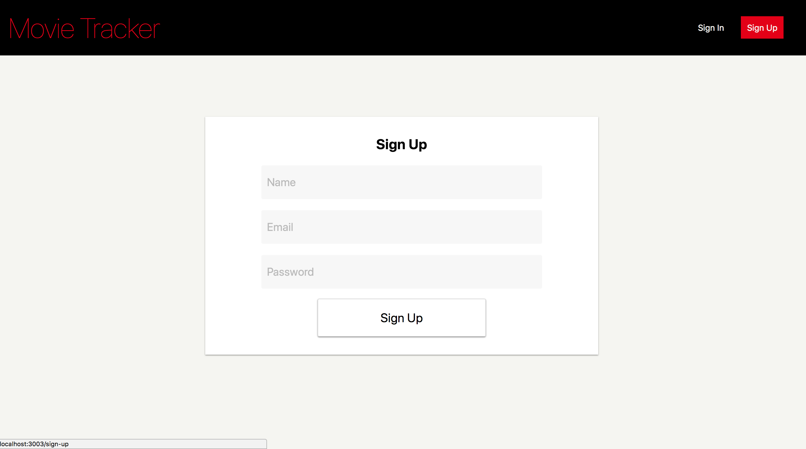
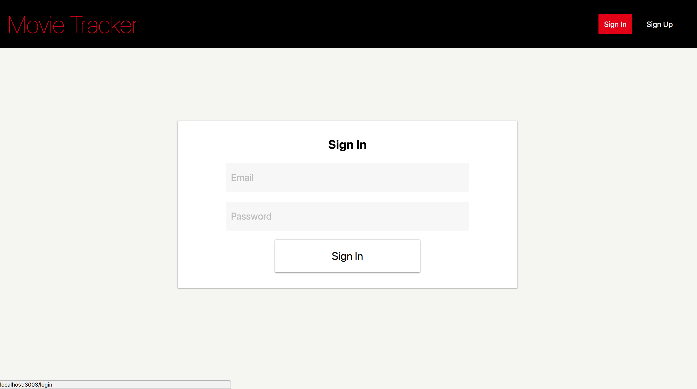

# MOVIE TRACKER

Movie Tracker is a webiste that utilizes react, redux and react-router to allow users to create an account, browse current movies and select favorites to view when logged in. We consumed data from the moviedb api to display current movies and utilized a postgress database to create users and save their favorites.

##### Iteration 0: Pull in movie API
 - [x] Pull most recent movies from MovieDB API.
 - [x] Display each movie on root index `/`

##### Iteration 1: Sign In / Sign Out Functionality
  - [x] Be able to sign in on page `/login` and redirect user to `/`
    - [x] Flash "Email and Password do not match" - if password is incorrect
  - [x] Ability to create a user.
    - [x] Flash "Email has already been used" - if email has been taken
  - [x] The user has the ability to sign out.

##### Iteration 2: Favorites
  - [x] Each movie should be displayed with a favorite button.
  - [x] If the user is not signed in and clicks on a favorite button the user will be prompted with the request to create an account.
  - [x] Validate favorites before adding to db. Aka does that user already have the movie stored as favorites. There should be no duplicates.
  - [x] If the user visits `/favorites` they should see a list of all their favorite movies.
  - [x] The user should be able to delete favorites from `/favorites` or `/`.
  - [x] Favorite movies should have a visual indication on `/`.

##### Extensions:
  - [ ] A user stays signed in after refreshing the page. *Hint:* You will probably use localStorage.
  - [ ] Should only take real email addresses *Hint:* Look into regular expressions
  - [ ] A user can click and view any individual movie.

